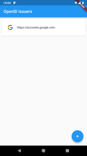
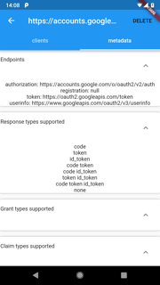

# openid_flutter_example

This is flutter app to demonstrate the use of the `openid_client` 
package.

## Screens

### Issuers list 
The home screen s
hows a list of known issuers. With the `+`-button, 
you can add a new issuer.




Clicking on an issuer will open the issuer details page with two tabs: 

* the discovered issuer metadata
* a list of configured clients

### Issuer metadata

This page shows the metadata of the issuer as discovered from the 
https://issuer.host/.well-known/openid-configuration url.





### Client list

Shows a list of configured clients for the selected issuer. One can add
additional clients with the `+`-button or edit an existing one.


Each client in the list has a `login`-button. Pressing this button
will open a browser window to start the authentication. After completing
the sign in and consent, you will return to the client list, where the
`login`-button will be replaced by a widget showing the details of the
newly signed in user.

Note: the Authorization Code with PKCE flow will be used


### Edit client

In the edit client page you can set the `client id` as well as the
scopes to be used.


## Some code

Code for signing in can be found in [lib/src/blocs.dart](lib/src/blocs.dart).
Extract below:

```dart
  Future<UserInfo> signIn(Map<String, dynamic> clientInfo) async {
    var uri = Uri.parse(clientInfo["issuer"]);
    
    // get an issuer
    var issuer = await Issuer.discover(uri);
    
    // create the client
    var client = new Client(
      issuer,
      clientInfo["client_id"],
    );
    
    // create an authenticator 
    var authenticator = new Authenticator(client,
        scopes: clientInfo["scopes"].split(","),
        port: 4000, urlLancher: (url) async {
      if (await canLaunch(url)) {
        await launch(url, forceWebView: true);
      } else {
        throw 'Could not launch $url';
      }
    });
    
    // start the authentication
    var c = await authenticator.authorize();
    
    // close the webview when finished
    closeWebView();
    
    // store the refresh token, so the user does not need to login again
    _storage.set("token:${clientInfo["id"]}", c.refreshToken);
    
    // get the user info
    var user = await c.getUserInfo();
    return user;
  }

```

### Notes on the `url_launcher` plugin

The latest released version of `url_launcher` [v4.0.1](https://pub.dartlang.org/packages/url_launcher/versions/4.0.1)
does not support closing the web view. This means that after sign in by the
user the web view will remain open and the user has to manually close the screen.

This [pull request](https://github.com/flutter/plugins/pull/658) adds the `closeWebView` method, so that the
web view can be closed programmatically. To use the version of the pull
request, use this in `pubspec.yaml`:

```yaml
dependencies:
  url_launcher:
    git:
      url: git://github.com/flutter/plugins.git
      path: packages/url_launcher
      ref: 2c56dd4cca2f5b85619eaea425baccb1e0600886
```

On android, when opening a web view, javascript is not enabled. 
Probably, the authentication web pages of the issuer will require javascript
however. Either, you'll need to use the external browser by setting `forceWebView`
to `false`, but this results in a worse user experience. Or, you'll
need to manually alter the `url_launcher` package to enable the javascript
by updating the file `UrlLauncherPlugin.java` as follows:

```java
    @Override
    public void onCreate(Bundle savedInstanceState) {
      super.onCreate(savedInstanceState);
      webview = new WebView(this);
      webview.getSettings().setJavaScriptEnabled(true); // add this line
      // ...
    }
```

Some issuers (e.g. google) will also complain if the `User-Agent` value of 
the web view does not match that of a known browser. To fix this, add the 
following or similar code to the same method:

```java
      String userAgent = webview.getSettings().getUserAgentString();
      userAgent = userAgent.replaceAll("Version[^\\s]+","");
      webview.getSettings().setUserAgentString(userAgent);
```

